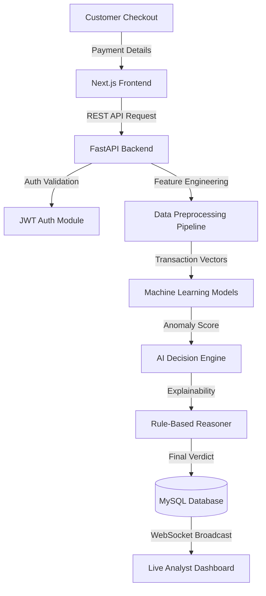

<div align="center">
  
  <h1 align="center">FraudShield AI (Enterprise v10.0)</h1>
  <p align="center">
    <strong>Enterprise-Grade Payment Fraud Prevention & AI Decision Engine</strong>
  </p>
  
  <p align="center">
    
    
    
    
    
  </p>
</div>

---

## 📖 Project Overview

**FraudShield AI** is a production-ready enterprise payment fraud detection and transaction intelligence platform. Built using modern Full-Stack Development, Machine Learning, Business Intelligence, and Enterprise Software Engineering practices, this platform analyzes transactions in real-time, blocks fraudulent activity, and provides human-readable AI explanations for every decision.

Developed as a comprehensive Final Year Project, it serves as a portfolio-ready demonstration of full-stack engineering, CI/CD, DevOps, and applied AI.

## ✨ Features

- 🧠 **AI Decision Engine:** Real-time transaction scoring using dynamic Machine Learning pipelines (XGBoost, Random Forest, Decision Trees, Logistic Regression).
- 🔍 **Rule-Based Explainability:** Human-readable reasoning for every AI decision based on velocity, location, and behavior.
- 🔐 **Enterprise Security:** JWT Auth, Refresh Tokens, BCrypt hashing, and strict Role-Based Access Control (RBAC).
- 🚀 **Real-Time WebSockets:** Live streaming of fraud alerts, new transactions, and system KPIs directly to the dashboard.
- 📊 **360° Profiles:** Deep-dive intelligence into Customer behavior, Merchant risk, and historic timelines.
- 🕵️ **Investigation Workspace:** Enterprise case management tools for fraud analysts.
- 💳 **Payment Simulator:** End-to-end, live simulation of payments intercepted by the AI engine.

## 🏗️ Architecture Diagram



## 🛠️ Tech Stack

- **Frontend:** Next.js 14 (App Router), React, TailwindCSS, Framer Motion, Recharts.
- **Backend:** FastAPI, Uvicorn, SQLAlchemy (ORM), JWT, WebSockets.
- **Machine Learning:** Scikit-Learn, XGBoost, Pandas, Joblib.
- **Database:** MySQL 8.0 (Production), SQLite (Local Dev).
- **DevOps:** Docker, Docker Compose, GitHub Actions (CI/CD), Vercel, Render.

## 📂 Folder Structure

```
FraudShield-AI/
├── backend/               # FastAPI Application
│   ├── app/               # Core Application (API, Models, Services)
│   ├── ml_engine/         # Machine Learning Pipelines
│   ├── tests/             # Pytest Suites
│   ├── Dockerfile         # Backend Container
│   └── requirements.txt   # Python Dependencies
├── frontend/              # Next.js Application
│   ├── src/app/           # App Router & Pages
│   ├── src/components/    # Reusable React UI
│   ├── Dockerfile         # Frontend Container
│   └── package.json       # NPM Dependencies
├── database/              # DB Initialization Scripts
├── .github/workflows/     # GitHub Actions CI/CD
├── docker-compose.yml     # Local Orchestration
└── README.md
```

## 💻 Installation & Setup

A convenient batch script is provided for Windows users to automatically setup a fresh environment.

```bash
# 1. Clone the repository
git clone https://github.com/your-username/fraudshield-ai.git
cd fraudshield-ai

# 2. Start the servers (Requires Node.js 20+ and Python 3.11+)
.\start.bat
```
The script will automatically create the Python virtual environment, install all PIP and NPM dependencies, seed the initial database, and boot both servers.
- Frontend Dashboard: `http://localhost:3000`
- Backend API Docs: `http://localhost:8000/docs`

## 🐳 Docker Setup

To run the entire platform (MySQL, FastAPI, Next.js) inside isolated containers:
```bash
docker-compose up -d --build
```

## ☁️ Deployment Guide

This repository includes Infrastructure-as-Code (IaC) files for zero-modification deployment.
- **Frontend (Vercel):** Connect your GitHub repo to Vercel. It will auto-detect the `vercel.json` config.
- **Backend (Render):** Connect your GitHub repo to Render using the `render.yaml` Blueprint.
- **Database (Railway):** Provision a MySQL DB on Railway and inject the `DATABASE_URL` into Render.

## 🤖 ML Workflow

1. Data is loaded and cleaned from the SQL database.
2. The `train_models.py` pipeline engineers features (Velocity, Geo-distance, Amounts).
3. It trains four distinct models simultaneously.
4. It compares Accuracy, F1, and ROC-AUC scores.
5. The champion model is serialized via `joblib` and instantly hot-swapped into the running FastAPI instance.

## 🔮 Future Enhancements

- Integrate external IP reputation API services (e.g., MaxMind).
- Add two-factor authentication (2FA) for Fraud Analysts.
- Implement graph databases (Neo4j) to detect fraud rings visually.

## 🛡️ License
MIT License.
