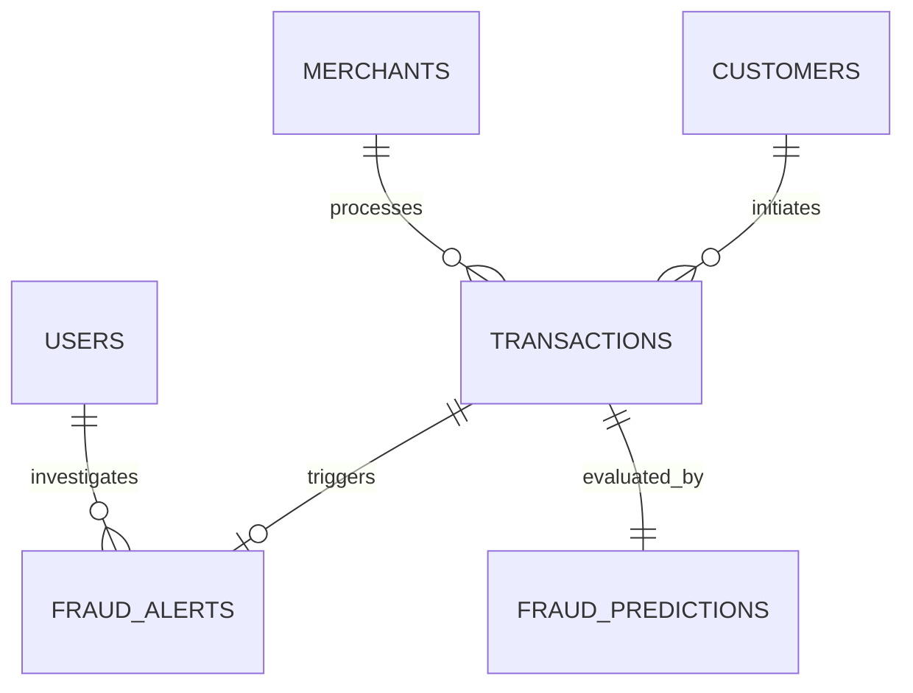

# 🚀 FraudShield AI Enterprise

**FraudShield AI** is an enterprise-inspired payment fraud detection platform built using modern full-stack technologies. It demonstrates real-world software architecture, machine learning integration, role-based authentication, analytics dashboards, and secure payment risk analysis.

---

## 🌟 Features

- **Enterprise UI/UX**: Premium, responsive interfaces built with Next.js, Tailwind CSS, shadcn/ui, and Framer Motion.
- **Rule-Based Explainability AI**: Evaluates transactions instantly using Machine Learning alongside Business Rules, returning comprehensive human-readable reasons for decisions.
- **Role-Based Access Control (RBAC)**: Secure access gating for Admins, Fraud Analysts, Risk Managers, and Customers using JWT and BCrypt.
- **Real-Time Infrastructure**: WebSockets integration via FastAPI for instantaneous broadcasting of new transactions, alerts, and KPI updates without page refreshes.
- **Admin Transaction Testing Console**: A dedicated interface (`/dashboard/upload`) for manually pushing JSON payloads and CSV batch files through the AI Decision Engine.
- **Comprehensive Dashboards**: Executive, Fraud, Customer 360, Merchant 360, and Investigation Workspaces.
- **Dockerized Deployments**: Pre-configured `Dockerfile`s, `render.yaml`, `vercel.json`, and `railway.json` for seamless cloud deployment.

---

## 🏗️ Enterprise Architecture

FraudShield AI follows a clean, decoupled architecture:
1. **Presentation Layer**: Next.js 15 (React 19) App Router handling SSR/SSG and client-side rendering.
2. **API Layer**: FastAPI (Python) serving highly concurrent RESTful endpoints and WebSockets.
3. **Service Layer**: Decoupled business logic (Transaction processing, ML inference, Alert generation).
4. **Data Layer**: SQLAlchemy ORM integrating seamlessly with SQLite (Local) or MySQL/PostgreSQL (Production).

### Entity Relationship Diagram (ERD)


### Folder Structure
```text
FraudShield-AI/
├── backend/                  # FastAPI Application
│   ├── app/
│   │   ├── api/              # REST Endpoints & WebSockets
│   │   ├── auth/             # JWT & RBAC Logic
│   │   ├── core/             # Config & Database Setup
│   │   ├── models/           # SQLAlchemy Data Models
│   │   ├── repositories/     # Data Access Layer
│   │   └── services/         # Business Logic & Decision Engine
│   ├── seed.py               # Enterprise Data Generator
│   └── requirements.txt      # Python Dependencies
├── frontend/                 # Next.js Application
│   ├── src/
│   │   ├── app/              # App Router Pages
│   │   ├── components/       # Reusable UI Components
│   │   ├── hooks/            # Custom React Hooks (WebSockets)
│   │   └── lib/              # Utilities & API Clients
│   └── package.json          # Node Dependencies
├── ml_engine/                # Machine Learning Pipeline
│   ├── notebooks/            # EDA Jupyter Notebooks
│   ├── train_model.py        # Model Training Script
│   └── models/               # Serialized .joblib Models
├── tests/                    # Pytest Test Suite
├── .github/workflows/        # CI/CD Pipelines
└── docker-compose.yml        # Docker Orchestration
```

---

## 🛠️ Tech Stack

**Frontend**
- Next.js 15 (App Router), React 19, TypeScript
- Tailwind CSS, shadcn/ui, Framer Motion, Recharts, TanStack Table

**Backend**
- Python 3.11, FastAPI, Uvicorn, WebSockets
- SQLAlchemy, SQLite / MySQL, PyJWT, Passlib, Pydantic

**Machine Learning**
- Scikit-learn, XGBoost, Pandas, NumPy, Joblib

**DevOps & Deployment**
- Docker & Docker Compose
- GitHub Actions (CI)
- Vercel (Frontend), Render/Railway (Backend)

---

## 🚀 Deployment Guide

### Prerequisites
- Node.js 20+
- Python 3.10+
- Docker (optional)

### 1. Local Development (Without Docker)

**Backend Setup:**
```bash
cd backend
python -m venv venv
source venv/bin/activate  # On Windows: venv\Scripts\activate
pip install -r requirements.txt
python seed.py  # Generates 5000+ realistic enterprise records
uvicorn app.main:app --reload --port 8000
```

**Frontend Setup:**
```bash
cd frontend
npm install
npm run dev
```

### 2. Docker Compose (Production Ready)
```bash
docker-compose up --build -d
```
*Frontend will be available on `http://localhost:3000` and Backend on `http://localhost:8000`.*

---

## 🧪 Testing Instructions
This project is built with test-driven robustness. To run the automated tests:
```bash
cd backend
export PYTHONPATH=$(pwd)
pytest ../tests/ -v
```

---

## 📚 API Documentation (Swagger)
Once the backend is running, visit:
- **Swagger UI**: `http://localhost:8000/docs`
- **ReDoc**: `http://localhost:8000/redoc`

### Core Endpoints
- `POST /api/v1/auth/login` - Issue JWT token
- `POST /api/v1/payments/upload` - Evaluate transactions via AI (JSON/CSV)
- `GET /api/v1/dashboard/stats` - Fetch aggregate executive KPIs
- `WS /ws` - WebSocket real-time event broadcast

---

## 🛡️ Machine Learning Pipeline
The `ml_engine/` directory contains scripts to synthetically generate millions of transaction rows, preprocess them, and train multiple models (`LogisticRegression`, `DecisionTree`, `RandomForest`, `XGBoost`). The champion model is selected via ROC-AUC scoring and exported as `fraud_model.joblib`.

During inference, SHAP is avoided to ensure sub-100ms response times. Instead, a lightweight **Rule-Based Explainability Engine** maps model probabilities back to exact business logic rules.
