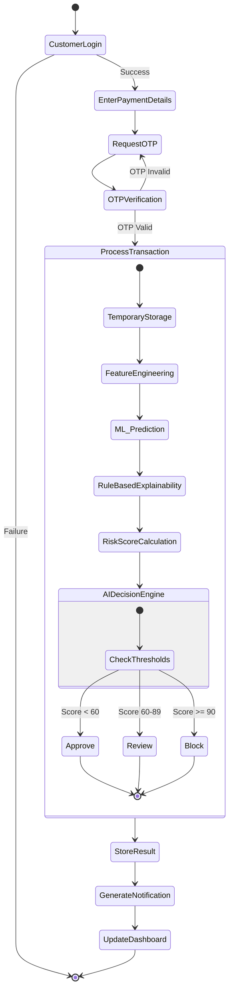

# Activity Diagram: Payment & Fraud Detection Flow

```mermaid
stateDiagram-v2
    [*] --> CustomerLogin
    
    CustomerLogin --> EnterPaymentDetails : Success
    CustomerLogin --> [*] : Failure
    
    EnterPaymentDetails --> RequestOTP
    RequestOTP --> OTPVerification
    
    OTPVerification --> ProcessTransaction : OTP Valid
    OTPVerification --> RequestOTP : OTP Invalid
    
    state ProcessTransaction {
        [*] --> TemporaryStorage
        TemporaryStorage --> FeatureEngineering
        FeatureEngineering --> ML_Prediction
        ML_Prediction --> RuleBasedExplainability
        RuleBasedExplainability --> RiskScoreCalculation
        RiskScoreCalculation --> AIDecisionEngine
        
        state AIDecisionEngine {
            [*] --> CheckThresholds
            CheckThresholds --> Approve : Score < 60
            CheckThresholds --> Review : Score 60-89
            CheckThresholds --> Block : Score >= 90
        }
        
        Approve --> [*]
        Review --> [*]
        Block --> [*]
    }
    
    ProcessTransaction --> StoreResult
    StoreResult --> GenerateNotification
    GenerateNotification --> UpdateDashboard
    UpdateDashboard --> [*]
```
