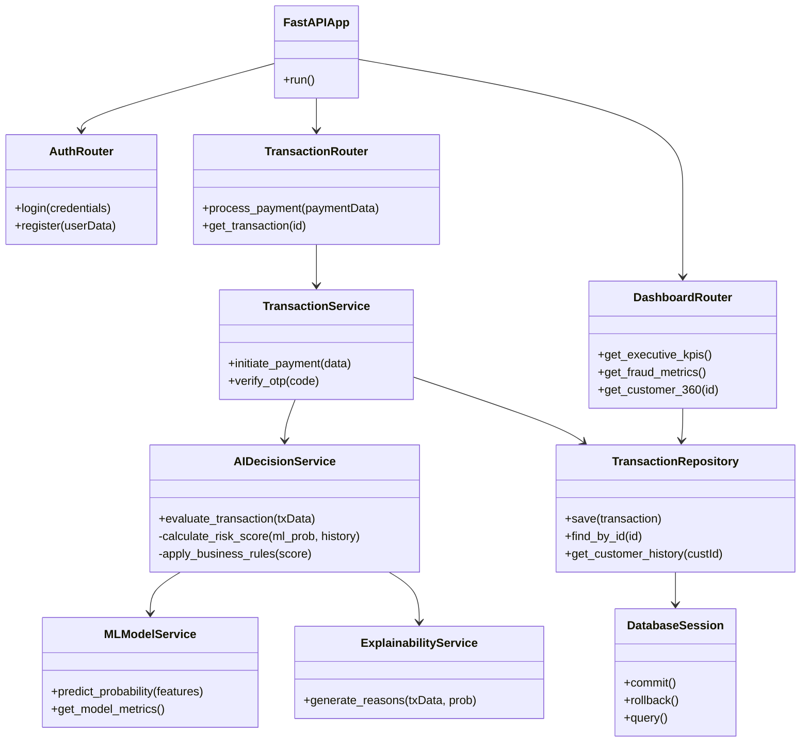

# Class Diagram: Backend MVC Architecture

```mermaid
classDiagram
    class FastAPIApp {
        +run()
    }
    
    class AuthRouter {
        +login(credentials)
        +register(userData)
    }
    
    class TransactionRouter {
        +process_payment(paymentData)
        +get_transaction(id)
    }
    
    class DashboardRouter {
        +get_executive_kpis()
        +get_fraud_metrics()
        +get_customer_360(id)
    }

    class TransactionService {
        +initiate_payment(data)
        +verify_otp(code)
    }

    class AIDecisionService {
        +evaluate_transaction(txData)
        -calculate_risk_score(ml_prob, history)
        -apply_business_rules(score)
    }

    class MLModelService {
        +predict_probability(features)
        +get_model_metrics()
    }

    class ExplainabilityService {
        +generate_reasons(txData, prob)
    }

    class TransactionRepository {
        +save(transaction)
        +find_by_id(id)
        +get_customer_history(custId)
    }

    class DatabaseSession {
        +commit()
        +rollback()
        +query()
    }

    FastAPIApp --> AuthRouter
    FastAPIApp --> TransactionRouter
    FastAPIApp --> DashboardRouter

    TransactionRouter --> TransactionService
    TransactionService --> AIDecisionService
    
    AIDecisionService --> MLModelService
    AIDecisionService --> ExplainabilityService
    
    TransactionService --> TransactionRepository
    DashboardRouter --> TransactionRepository
    
    TransactionRepository --> DatabaseSession
```
