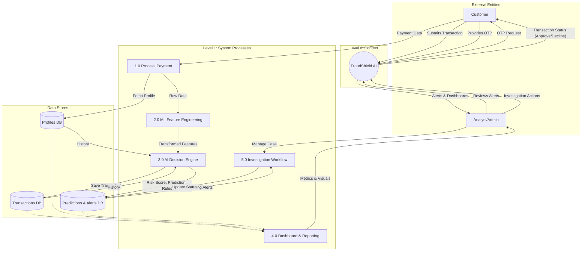

# Data Flow Diagram (DFD)

```mermaid
flowchart TD
    subgraph External Entities
        C[Customer]
        A[Analyst/Admin]
    end

    subgraph "Level 0: Context"
        FSAI((FraudShield AI))
    end

    C -- "Submits Transaction" --> FSAI
    FSAI -- "OTP Request" --> C
    C -- "Provides OTP" --> FSAI
    FSAI -- "Transaction Status (Approve/Decline)" --> C

    A -- "Reviews Alerts" --> FSAI
    FSAI -- "Alerts & Dashboards" --> A
    A -- "Investigation Actions" --> FSAI

    subgraph "Level 1: System Processes"
        P1[1.0 Process Payment]
        P2[2.0 ML Feature Engineering]
        P3[3.0 AI Decision Engine]
        P4[4.0 Dashboard & Reporting]
        P5[5.0 Investigation Workflow]
    end

    subgraph Data Stores
        D1[(Transactions DB)]
        D2[(Profiles DB)]
        D3[(Predictions & Alerts DB)]
    end

    C -- "Payment Data" --> P1
    P1 -- "Raw Data" --> P2
    P2 -- "Transformed Features" --> P3
    P3 -- "Risk Score, Prediction, Rules" --> D3
    P3 -- "Save Transaction" --> D1
    
    P1 -- "Fetch Profile" --> D2
    D1 -- "History" --> P3
    D2 -- "History" --> P3

    D1 -.-> P4
    D2 -.-> P4
    D3 -.-> P4
    
    P4 -- "Metrics & Visuals" --> A
    D3 -- "Pending Alerts" --> P5
    A -- "Manage Case" --> P5
    P5 -- "Update Status" --> D3
```
