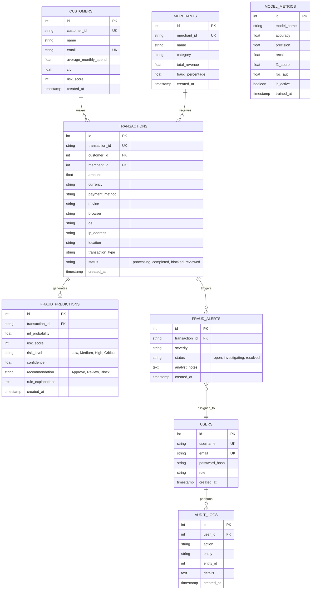

# Entity-Relationship Diagram (ERD)

```mermaid
erDiagram
    USERS {
        int id PK
        string username UK
        string email UK
        string password_hash
        string role
        timestamp created_at
    }
    
    CUSTOMERS {
        int id PK
        string customer_id UK
        string name
        string email UK
        float average_monthly_spend
        float clv
        int risk_score
        timestamp created_at
    }
    
    MERCHANTS {
        int id PK
        string merchant_id UK
        string name
        string category
        float total_revenue
        float fraud_percentage
        timestamp created_at
    }
    
    TRANSACTIONS {
        int id PK
        string transaction_id UK
        int customer_id FK
        int merchant_id FK
        float amount
        string currency
        string payment_method
        string device
        string browser
        string os
        string ip_address
        string location
        string transaction_type
        string status "processing, completed, blocked, reviewed"
        timestamp created_at
    }
    
    FRAUD_PREDICTIONS {
        int id PK
        string transaction_id FK
        float ml_probability
        int risk_score
        string risk_level "Low, Medium, High, Critical"
        float confidence
        string recommendation "Approve, Review, Block"
        text rule_explanations
        timestamp created_at
    }
    
    FRAUD_ALERTS {
        int id PK
        string transaction_id FK
        string severity
        string status "open, investigating, resolved"
        text analyst_notes
        timestamp created_at
    }
    
    AUDIT_LOGS {
        int id PK
        int user_id FK
        string action
        string entity
        int entity_id
        text details
        timestamp created_at
    }

    MODEL_METRICS {
        int id PK
        string model_name
        float accuracy
        float precision
        float recall
        float f1_score
        float roc_auc
        boolean is_active
        timestamp trained_at
    }

    CUSTOMERS ||--o{ TRANSACTIONS : "makes"
    MERCHANTS ||--o{ TRANSACTIONS : "receives"
    TRANSACTIONS ||--o| FRAUD_PREDICTIONS : "generates"
    TRANSACTIONS ||--o{ FRAUD_ALERTS : "triggers"
    USERS ||--o{ AUDIT_LOGS : "performs"
    FRAUD_ALERTS }o--|| USERS : "assigned_to"
```
