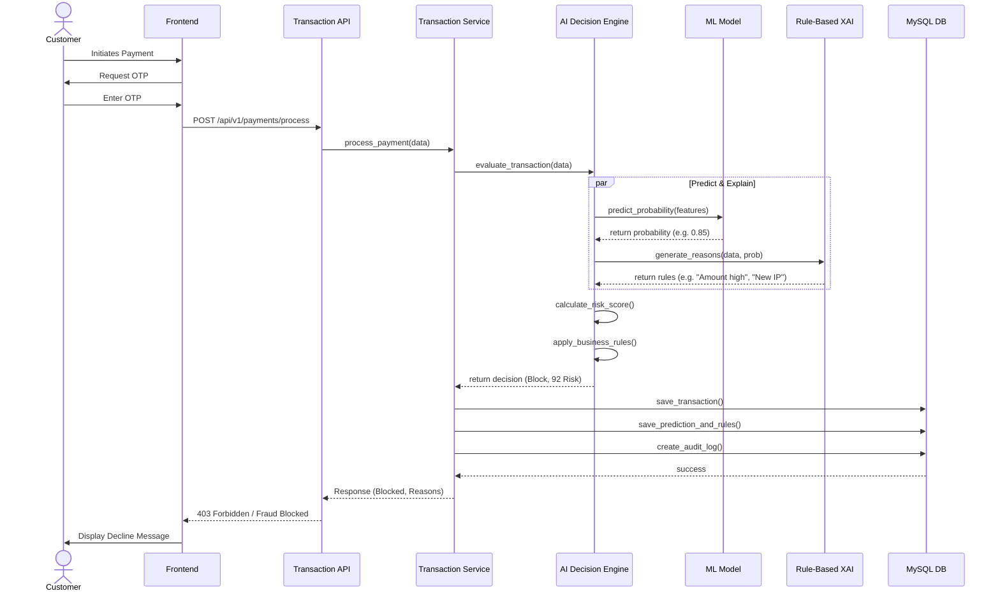

# Sequence Diagram: AI Decision Flow

```mermaid
sequenceDiagram
    actor Customer
    participant Frontend
    participant API as Transaction API
    participant Service as Transaction Service
    participant AI as AI Decision Engine
    participant ML as ML Model
    participant XAI as Rule-Based XAI
    participant DB as MySQL DB

    Customer->>Frontend: Initiates Payment
    Frontend->>Customer: Request OTP
    Customer->>Frontend: Enter OTP
    Frontend->>API: POST /api/v1/payments/process
    API->>Service: process_payment(data)
    
    Service->>AI: evaluate_transaction(data)
    
    par Predict & Explain
        AI->>ML: predict_probability(features)
        ML-->>AI: return probability (e.g. 0.85)
        
        AI->>XAI: generate_reasons(data, prob)
        XAI-->>AI: return rules (e.g. "Amount high", "New IP")
    end
    
    AI->>AI: calculate_risk_score()
    AI->>AI: apply_business_rules()
    AI-->>Service: return decision (Block, 92 Risk)
    
    Service->>DB: save_transaction()
    Service->>DB: save_prediction_and_rules()
    Service->>DB: create_audit_log()
    DB-->>Service: success
    
    Service-->>API: Response (Blocked, Reasons)
    API-->>Frontend: 403 Forbidden / Fraud Blocked
    Frontend->>Customer: Display Decline Message
```
